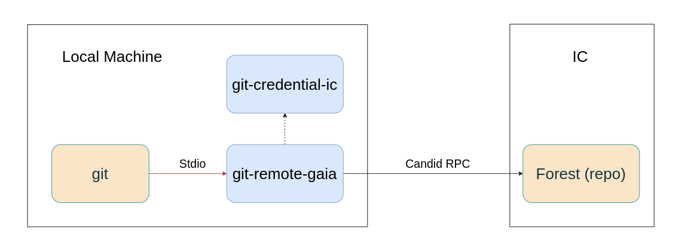

# Architecture

## Project Structure
```
├── src/
│   ├── candid/             # Candid interface definitions
│   ├── forest/             # Forest canister (repository)
│   ├── gaia/               # Gaia canister (core platform logic)
│   ├── gaia_frontend/      # Frontend application
│   └── git-remote-gaia/    # CLI helper (planned)
├── docs/                   # Project documentation
```

## Directory Structure Overview

### Forest Canister
Serves as the repository container, implementing an efficient Git Object DB with content-addressable storage. This canister handles:
- Git repository management
- Issue tracking and pull request workflows
- Access control for repositories

### Git-Remote-Gaia (Planned)



A command-line tool that extends Git to interact with repositories on the Internet Computer. Designed with stateless RPC principles to minimize computational load on IC canisters.

Key features:
- Git protocol implementation for IC-based repositories
- Authentication using Internet Identity
- Efficient delta encoding for reduced data transfer
- Local caching for improved performance

The core Git integration functionality is developed in a separate repository: [git-remote-helper](https://github.com/ImitationGameLabs/git-remote-helper).

Within Gaia, this component will be integrated to handle:
- Candid RPC calls to IC canisters via `ic_agent`
- Authentication with IC identities
- Transaction signing and verification

### Gaia Canister
The core platform component handling:
- User profiles and authentication
- Notification system
- Repository management (create, delete, transfer)
- Project exploration and discovery
- Social features (starring, following)
- Organization management
- Activity feeds
- Bounty marketplace

### Gaia Frontend
A modern web interface built with:
- Svelte framework for reactive UI
- Tailwind CSS for styling
- Vite build tooling
- Candid JS for canister interaction

Provides features including:
- Repository browsing and management
- Code viewing and editing
- Issue tracking
- Pull request workflows
- User dashboard