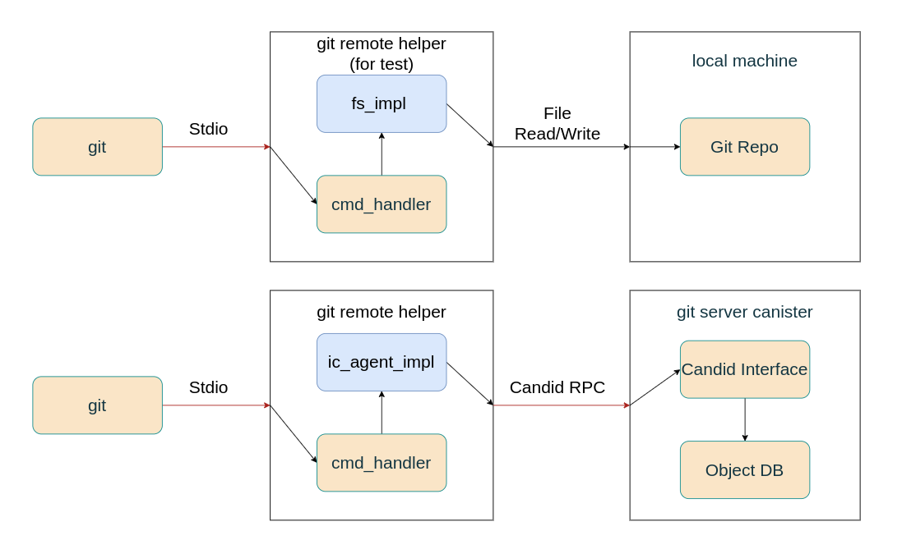

# Candid RPC Transport



 1. Design a `Remote` trait with stateless-rpc in mind.
	```rust
	    // Example
		trait Remote {
			async fn list_refs(&self, args: ListRefsArgs) -> RefsResult;
			async fn fetch(&self, oid: Vec<u8>) -> FetchResult;
			async fn push(&self, oid: Vec<u8>, obj: Vec<u8>) -> PushResult;
			// ...
		}
	```
 2. Implement git remote helper command handlers using a `Remote` trait object.
 3. Implement the `Remote` trait for `FsRemote`. 
	 - `FsRemote` interacts with a local repo. 
	 -  Test the git remote helper and  refine the `Remote` trait.
 4. Implement a Git Object Database as a canister using `ic-stable-structures`.
	 - `Log` for compact object storage
	 - `BTreeMap` mapping SHA1 -> index in `StableLog`
	 - `Vec` for Git refs management
 5. Design a candid interface that satisfies all functionality requirements of the `Remote` trait for git remote helpers.
 6. Implement the candid interface for the Git Object Database.
 7. Implement  a git remote helper using `ic_agent`.
	 - Interact with the candid interface.
	 - Authenticate via ICP identity.

References:
 - https://github.com/GitoxideLabs/gitoxide
 - https://github.com/dfinity/stable-structures
 - http://github.com/ImitationGameLabs/git-remote-helper
